# iCourse Subscriber

自动监控复旦大学 iCourse 智慧教学平台的课程更新，对新课次的录播视频进行**语音转文字 + AI 摘要**，并通过邮件推送到你的邮箱。

部署在 GitHub Actions 上，每天定时运行，**零成本、免服务器、全自动**。

> [!NOTE]
> 本项目严禁大规模传播（例如，不准分享到树洞、班级群、大群等地），否则信息办可能随时ban掉该项目。
> 如果该项目对你有用，请点个star作为对作者的鼓励。在使用前，请认真阅读下方的合规说明。

## 它能做什么？

假设你选了「摸鱼学导论」和「躺平学原理」两门课。在每天设定的时间，iCourse Subscriber 会自动：

1. 登录你的复旦 iCourse 账号（通过 WebVPN）
2. 检查这两门课是否有新的录播视频
3. 如果有：流式提取音频 → 语音识别 → AI 生成课程笔记
4. 将所有新课次的笔记汇总成**一封邮件**发送给你

邮件包含专业排版的 Markdown 渲染内容（含 LaTeX 公式渲染），覆盖课程重点、讲解内容、例子讲解等。如果老师提到了作业、考试、签到、组队等重要课程事项，会在笔记开头醒目标注。

> [!CAUTION]
> **⚠️ 合规使用声明**
>
> 本项目的设计初衷仅为辅助本校学生进行**个人的日常学习与复习**与进行技术交流。程序采用"封闭容器、流式处理、阅后即焚"的架构，默认不保存任何视频文件。任何人在部署和使用本项目时，必须严格遵守《复旦大学智慧教学资源平台使用规范》及相关校纪校规。**严禁使用者利用本程序进行以下违规操作，一切因滥用导致的账号封禁或纪律处分（如通报批评、限制平台权限等），均由使用者自行承担，与本仓库及作者无关：**
>
> * **严禁二次分发与传播**：《规范》第二部分明确指出，平台教学资源属于职务作品，未经许可不得传播。**禁止**将推送到你邮箱的课程摘要、转录文本或笔记转发给他人，或发布到任何公共网络平台。
> * **严禁修改代码非法下载视频**：《规范》严禁未经许可对平台资源进行复制和下载。基于此，本项目并不留存视频，**严禁**任何人修改源代码将受版权保护的课程录播违规下载、保存到任何本地或云端存储介质。
> * **严禁解密或泄露数据库**：仓库中的 `icourse.db.enc` 仅用于程序追踪课次进度避免重复计算。**严禁**手动解密该数据库以提取、滥用或公开其中的转录和摘要文本信息。
> * **注意账号环境安全**：本程序会使用你的 UIS 凭证进行云端 WebVPN 自动化登录，有触发异地登录风控的可能。请妥善保管个人 Secret，因使用云端自动化服务导致的账号异常风险由使用者自行评估。
>
> **当你 Fork 并配置 Secret 运行本项目时，即代表你已知晓上述风险，并承诺仅在授权范围内为个人学习目的使用本工具，遵守相关校纪校规。**

## 快速部署（5 分钟）

### 第 1 步：Fork 本仓库

点击页面右上角的 **Fork** 按钮，将仓库复制到你的 GitHub 账号下。

### 第 2 步：配置 Secrets

进入你 Fork 后的仓库，点击 **Settings → Secrets and variables → Actions → New repository secret**，逐个添加以下 Secret：

| Secret 名称 | 必填 | 说明 | 示例 |
|---|---|---|---|
| `STUID` | ✅ | 复旦学号 | `22307110000` |
| `UISPSW` | ✅ | UIS 统一身份认证密码 | `your_password` |
| `COURSE_IDS` | ✅ | 要监控的课程 ID，多个用英文逗号分隔 | `35472,30251` |
| `DASHSCOPE_API_KEY` | ⬜ | ModelScope 平台 API Key | `ms-xxxxxxxx` |
| `DEEPSEEK_API_KEY` | ⬜ | DeepSeek API Key（推荐） | `sk-xxxxxxxx` |
| `GEMINI_API_KEY` | ⬜ | Gemini API Key | `AIza...` |
| `SMTP_EMAIL` | ✅ | 用于发送邮件的 QQ 邮箱 | `123456@qq.com` |
| `SMTP_PASSWORD` | ✅ | QQ 邮箱 SMTP **授权码**（不是登录密码） | `abcdefghijklmnop` |
| `RECEIVER_EMAIL` | ✅ | 接收摘要邮件的邮箱 | `you@m.fudan.edu.com` |

> 至少配置一个 LLM API Key（DASHSCOPE、DEEPSEEK 或 GEMINI）。程序按配置顺序自动回退尝试。

### 第 3 步：获取课程 ID

登录 [iCourse 网页版](https://icourse.fudan.edu.cn)，进入你要监控的课程页面，URL 中的数字就是课程 ID：


多门课用英文逗号隔开：`35472,30251,40123`

### 第 4 步：获取 API Key

选择一个或多个模型服务商：

| 服务商 | 获取方式 | 免费额度 |
|---|---|---|
| **ModelScope**（`DASHSCOPE_API_KEY`） | [API 密钥管理](https://modelscope.cn/my/myaccesstoken) | 每天 2000 次 |
| **DeepSeek**（`DEEPSEEK_API_KEY`） | [DeepSeek Platform](https://platform.deepseek.com/) | 注册赠额度 |
| **Gemini**（`GEMINI_API_KEY`） | [Google AI Studio](https://aistudio.google.com/) | 每月免费额度 |

### 第 5 步：获取 QQ 邮箱 SMTP 授权码

1. 登录 [QQ 邮箱](https://mail.qq.com) → 设置 → 账户与安全 → 安全设置
2. 找到「POP3/IMAP/SMTP/Exchange/CardDAV/CalDAV 服务」
3. 开启 SMTP 服务，按提示获取**授权码**（16 位字母）
4. 将授权码填入 `SMTP_PASSWORD`

### 第 6 步：运行

- **自动运行**：默认每天 19:36（北京时间）自动执行
- **手动触发**：进入仓库 → Actions → **iCourse Check** → Run workflow
- **立即触发**：也可通过前端页面点击「触发订阅检查」按钮

首次运行会处理所有已有录播，后续只处理新增课次。

## 前端页面（索引与查看）

本项目自带一个浏览器端加密数据库查看器，部署在 GitHub Pages：

访问 `https://你的用户名.github.io/Fudan_iCourse_Subscriber/`

功能介绍：
- **浏览器端解密**：输入你的凭据，浏览器用 WebCrypto 解密 sql.js 读取 shard 数据库，凭据不离开本地
- **按课程/课次浏览**：查看每节课的转录和摘要内容
- **订阅编辑器**：从学期课程目录中搜索、勾选课程，一键保存到 GitHub Secret 并触发工作流
- **CDN 视频签名播放**：浏览器内计算 CDN 签名参数，直接在浏览器中播放课程视频
- **导出 PDF**：通过 GitHub Actions 触发导出工作流，生成格式化课程笔记 PDF 并邮件发送

> 前端页面需要你手动在 GitHub Pages 设置中开启（Settings → Pages → Source → GitHub Actions），然后触发一次 Deploy Frontend workflow 即可部署。

## 本地运行（Linux/macOS）

```bash
git clone https://github.com/你的用户名/Fudan_iCourse_Subscriber.git
cd Fudan_iCourse_Subscriber

pip install -r requirements.txt
sudo apt install ffmpeg   # Ubuntu/Debian

# 下载 SenseVoice ASR 模型（~200MB）
wget https://github.com/k2-fsa/sherpa-onnx/releases/download/asr-models/sherpa-onnx-sense-voice-zh-en-ja-ko-yue-2024-07-17.tar.bz2
tar xf sherpa-onnx-sense-voice-zh-en-ja-ko-yue-2024-07-17.tar.bz2
rm sherpa-onnx-sense-voice-zh-en-ja-ko-yue-2024-07-17.tar.bz2
wget https://github.com/k2-fsa/sherpa-onnx/releases/download/asr-models/silero_vad.onnx

export STUID=你的学号
export UISPsw=你的密码
export COURSE_IDS=课程ID
export DEEPSEEK_API_KEY=sk-xxx

python main.py
```

## 数据安全与知识产权

- **不保留视频**：音频通过 ffmpeg 管道从 CDN 流式提取并实时转录，全程不下载或保存任何视频/音频文件
- **数据库加密存储**：SQLite 数据库使用 AES-256-CBC 加密后拆分 shard 推送，密钥由 `sha256("ICSv2:" + STUID + ":" + UISPSW)` 派生（100,000 次 PBKDF2 迭代），即使仓库公开也无法解密
- **前端零泄漏**：前端页面解密全部在浏览器端用 WebCrypto 完成，凭据不通过网络传输
- **Fork 安全**：他人 Fork 后因 Secret 不同会解密失败，程序自动从空数据库开始，不会报错

---

## 详细技术文档

以下内容面向对实现细节感兴趣的开发者，涵盖项目架构、各模块设计原理、关键算法、线程安全模型和性能优化策略。

---

### 项目结构

项目从早期的单体文件逐步重构为分层子包架构，总代码量约 8,500 行（31 个源文件）。

```
├── main.py                                # 顶层编排入口
├── scripts/
│   ├── db_shard.py                        # 数据库 shard/reassemble CLI
│   ├── merge_db.py                        # 两路并行 workflow 的数据库合并
│   ├── export_course.py                   # 按课程/课次导出笔记到 PDF/邮件
│   └── reset_course_data.py               # 重置特定课程的数据（触发重跑）
├── frontend/                              # GitHub Pages 加密数据库查看器
│   ├── index.html                         # 单页应用入口（Alpine.js）
│   └── js/
│       ├── app.js                         # 路由/状态/视图逻辑（661 行）
│       ├── db.js                          # sql.js 查询封装
│       ├── schema.js                      # 前端 schema 镜像
│       ├── crypto.js                      # WebCrypto AES-256-CBC 解密/shard 重组
│       └── github.js                      # GitHub API：拉取 shard 写入 secret 触发 workflow
├── src/
│   ├── api/                               # 外部 API 客户端
│   │   ├── webvpn.py                      # WebVPN AES-128-CFB 加密 + 7 步 IDP 认证
│   │   ├── icourse.py                     # iCourse API + CDN 视频签名
│   │   └── emailer.py                     # MIME 邮件生成（LaTeX CID 嵌入）
│   ├── data/                              # 数据持久化
│   │   ├── database.py                    # SQLite ORM + 运行时迁移
│   │   ├── schema.py                      # 表结构定义（唯一真相来源）
│   │   ├── sharder.py                     # 数据库分片/加密/重组
│   │   └── crypto_box.py                  # OpenSSL 兼容 AES-256-CBC + PBKDF2
│   ├── ai/                                # AI 处理
│   │   ├── transcriber.py                 # 语音识别：SenseVoice/FireRed/Zipformer
│   │   ├── summarizer.py                  # 多模型回退 LLM 摘要
│   │   ├── ocr.py                         # RapidOCR 封装（线程安全懒加载）
│   │   ├── ppt_dedup.py                   # dHash 去重 + invalid 页面 + UI 噪声清洗
│   │   └── bucketer.py                    # 10 分钟 bucket 对齐 ASR+OCR 文本
│   ├── pipeline/                          # 执行流程编排
│   │   ├── lecture_runner.py              # 单节 8 阶段状态机
│   │   └── ppt_pipeline.py                # PPT 四阶段流水线
│   └── runtime/                           # 运行时基础设施
│       ├── config.py                      # 全环境变量驱动配置
│       ├── scheduler.py                   # 线程池 + 动态信号量 + 资源监控（576 行）
│       └── reporter.py                    # 中央日志 + 节流
├── .github/workflows/
│   ├── check.yml                          # 定时任务 + 完整执行
│   ├── single_run.yml                     # 按指定课程单次执行
│   ├── deploy-frontend.yml               # GitHub Pages 部署
│   ├── export.yml                         # 导出课程 PDF
│   └── reset_data.yml                     # 重置课程数据
└── requirements.txt                       # 11 个核心依赖
```

---

### 整体架构

#### 顶层编排

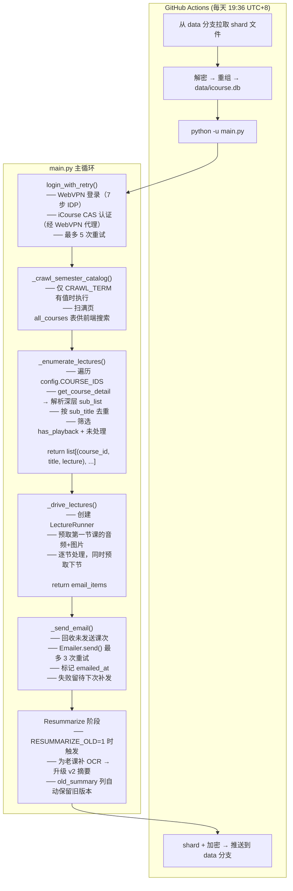

#### 每节课的处理流程（LectureRunner 8 阶段状态机）

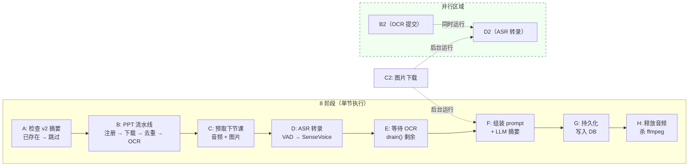

**设计要点**：Phase B 的 OCR 提交（`PPTAsyncHandle`）和 Phase D 的 ASR 转录**同时进行**。Phase C 的预取在 Phase D/F 期间后台运行，解耦了网络 I/O 与计算。Phase F 的 LLM 调用期间 CPU 空转（0%），此时下一节的图片和音频已在后台持续下载。

---

### WebVPN 认证（`src/api/webvpn.py`）

623 行，完整的 7 步 IDP/CAS 认证流程实现，逆向自前端 JS。

#### URL 加解密

复旦 WebVPN 使用 **AES-128-CFB（segment_size=128）** 对目标 URL 的主机名加密，密钥和 IV 均为固定值 `b"wrdvpnisthebest!"`：

```
原始 URL:  https://icourse.fudan.edu.cn/courseapi/v3/...
                            └── 加密 ──┘
WebVPN URL: https://webvpn.fudan.edu.cn/https/80/[32hex IV][密文hex]/courseapi/v3/...
                                              └── AES-128-CFB ──┘
```

#### 7 步认证流程

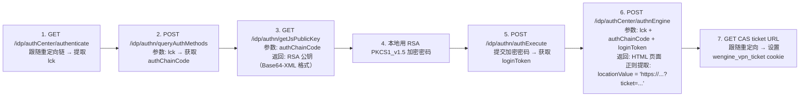

**关键细节：**
- Ticket 提取使用正则 `locationValue\s*=\s*"([^"]*ticket=[^"]*)"` 从 HTML 中抓取（IDP 以 JavaScript `locationValue` 而非 HTTP 302 返回 ticket）
- `authenticate_icourse()` 复用相同的 7 步流程，但所有请求通过 WebVPN 代理发送（`/https/443/加密主机名/idp/...`），实现 iCourse CAS 认证
- Session 活性检查：每次请求前检查 `wengine_vpn_ticket` cookie 是否存在及非空
- `_establish_session()` 内置 3 次重试，即使请求超时时也检查 cookie 是否已设置（超时可能晚于服务器收到请求）

---

### CDN 视频签名（`src/api/icourse.py`）

505 行，iCourse API 客户端，包含完整的 CDN 签名算法逆向。

#### 签名算法

签名参数通过逆向 webpack chunk `1P4N` 获得：

```python
def sign_video_url(video_url, user_id, tenant_id, phone, now):
    pathname = urlparse(video_url).path       # URL 中的路径部分
    reversed_phone = phone[::-1]              # 手机号字符串反转
    hash_input = f"{pathname}{user_id}{tenant_id}{reversed_phone}{now}"
    t = f"{user_id}-{now}-{md5(hash_input)}"
    return f"{video_url}?clientUUID={uuid4()}&t={t}"
```

**三级 URL 回退策略**（应对不同接口返回格式的差异）：

| 级别 | 字段 | 备注 |
|---|---|---|
| 1st | `video_list[*].preview_url` | URL 路径干净，优先使用 |
| 2nd | `playurl["0"]` / `playurl["1"]` | dict 结构，含 `now` 时间戳字段 |
| 3rd | `get-sub-detail` API 回退 | 最慢但一定能拿到 |

#### 课程详情枚举

```python
# 原始返回结构（4 层嵌套）
{
    "sub_list": {
        "2026": {                   # year
            "5": {                  # month
                "4": [{             # day
                    "sub_id": 616503,
                    "sub_title": "2026-05-22第6-8节",
                    "has_playback": 1,
                    ...
                }]
            }
        }
    }
}
```

`get_course_detail()` 解析 4 层迭代，将扁平化的 lecture dict 列表返回给上层。

#### PPT 列表分页

`get_ppt_list()` 从 `page=1` 开始逐一请求，直到返回空 JSON 或非 dict 为止：

```python
for page in itertools.count(1):
    resp = self._get(f"/courseapi/v3/cloud-classroom/get-ppt-list?course_id={course_id}&sub_id={sub_id}&pageNo={page}")
    raw = resp.json()
    if not raw or not isinstance(raw, dict):
        break
    ...
```

#### 学期课程爬取

`list_semester_courses(term)` 遍历所有页，每条记录包含 `course_id`, `title`, `teacher`, `dept_name`（兼容多个字段名），用于填充 `all_courses` 表供前端订阅编辑器使用。

---

### 语音转文字管道（`src/ai/transcriber.py`）

652 行，基于 sherpa-onnx + silero VAD 的流式语音识别。

#### 双路径消费模式

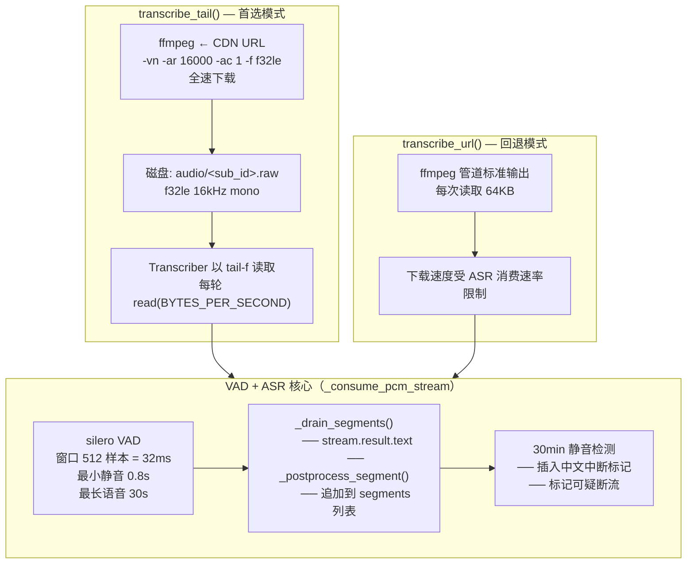

**解耦原理**：ffmpeg 全速下载音频到磁盘（~20 MB/s），ASR 以 own pace 从磁盘消费（~300 KB/s）。网络 I/O 与计算完全解耦。

#### 后端插件体系

通过 `config.ASR_BACKEND` 环境变量选择，出厂三个后端：

| 后端 | 模型 | 实时倍率 | 特点 |
|---|---|---|---|
| `sensevoice`（默认） | `sherpa-onnx-sense-voice-zh-en-ja-ko-yue` | ~25x | 多语言（中/英/日/韩/粤），ITN 文本规整 |
| `firered` | `sherpa-onnx-fire-red-asr2-ctc-zh_en-int8` | ~6x | 纯中英，CTC 模型，有 `<sil>` token |
| `zipformer` | `sherpa-onnx-zipformer-*`（encoder/decoder/joiner 三文件） | ~12x | Transducer 架构 |

```python
def _init(self):
    backend = self._backend
    if backend == "firered":
        self._recognizer = self._init_firered()       # from_fire_red_asr_ctc()
    elif backend == "sensevoice":
        self._recognizer = self._init_sensevoice()     # from_sense_voice(use_itn=True)
    elif backend == "zipformer":
        self._recognizer = self._init_zipformer()      # from_transducer(encoder, decoder, joiner)
```

#### VAD 配置（面向课堂的调优）

| 参数 | 值 | 说明 |
|---|---|---|
| `min_silence_duration` | 0.8 s | 短停顿不切分片段，增加每段长度 |
| `max_speech_duration` | 30.0 s | 匹配 SenseVoice 训练感受野 |
| `window_size` | 512 samples | 约 32ms @ 16kHz |
| `buffer_size_in_seconds` | 120 s | VAD 内部环形缓冲区 |

**为什么要调大 min_silence_duration**：原值 0.25s 会将讲师的自然换气、翻页停顿切成大量短片段（2-5s）。每个短片段需要独立的 ASR decode 固定开销，且 SenseVoice 的语种检测在 2s 片段上倾向误判为日语/英语，产出大量 "うん" 等跨语种污染。

**30 分钟静音中断检测**：如果在流中连续 30 分钟未检测到语音，在转录文本中注入 `[注意：从 XX 分钟处起已超过 XX 分钟未检测到语音，音频可能已中断或录音设备出现故障。以上内容可能不完整。]`。此检测在流末尾也执行一次，确保长音频尾部的中断被捕获。

#### 跨后端后处理（_postprocess_segment）

每个 ASR 片段在加入 segments 列表前经过多级清洗：

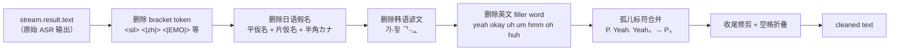

**不处理的词**：真正的技术英文缩写（CNN, FCN, YOLO, RGB, VGG-16, Transformer 等），因为白名单使用 `\b` 单词边界匹配——"YOLO" 不在白名单中，通过；"yeah" 在白名单中，删除。

---

### PPT 流水线（`src/pipeline/ppt_pipeline.py`）

四阶段设计，OCR 提交后与 ASR 并发执行。

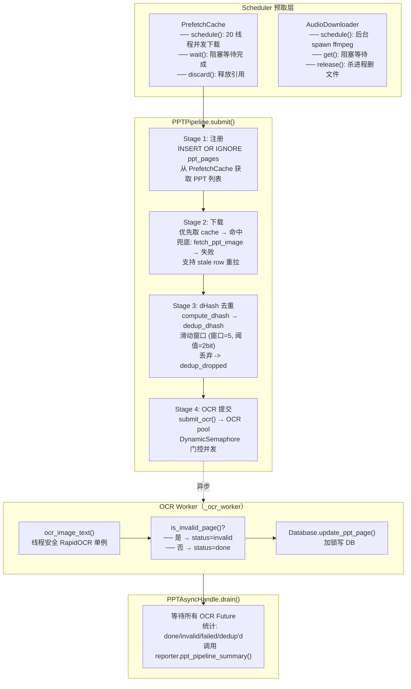

#### Stage 3：dHash 感知去重算法

```python
def dedup_dhash(items, window=5, threshold=2):
    """Sliding-window perceptual dedup.

    For each surviving anchor i, compare against the next `window` items;
    if Hamming distance ≤ threshold, mark the later index as dropped.

    Key property: already-dropped images never become anchors.
    This prevents a chain of "near to last-kept" pages from cascading
    drops onto pages that aren't actually near the kept anchor.
    """
    dropped = set()
    for i in range(len(items)):
        if i in dropped: continue
        a = items[i]
        if a is None: continue         # dHash decode failure — pass through
        for j in range(i + 1, min(i + 1 + window, len(items))):
            if j in dropped: continue
            b = items[j]
            if b is None: continue
            if hamming_hex(a, b) <= threshold:
                dropped.add(j)
    return sorted(dropped)
```

**窗口=5**：任何一页最多与后续 5 页比较。**阈值=2bit**：差异 ≤ 2 bit 视为重复（16 进制 dhash 字符串，每位 4bit）。**防级联**：已丢弃的页不作为锚点，避免近-远-更远的多米诺效应。

#### invalid 页面检测

在 OCR 后执行，基于特征子串匹配。将 OCR 文本进行归一化（去掉 `[\W_]`、lowercase ASCII）后逐一匹配：

```python
INVALID_PAGE_PATTERNS = [
    # Type 1 — 教室桌面壁纸
    "请不要关闭设备", "避免耽误第34节上课",
    "触控显示器无线话筒hdmi", "多媒体值班室",

    # Type 2 — iCourse 资源平台页面
    "cfdfudaneducn", "icoursefudaneducn",
    "智慧教学资源平台使用规范", "板书效果展示",
    "双屏效果展示", "课程录制exe", "ev去噪",
    "推荐上传至elearning", "ppt演示者视图会影响录屏",
    ...
]
```

归一化函数：`re.sub(r"[\W_]+", "", text).lower()` — 兼容 OCR 噪声导致的轻微变异（如 OCR 将 "icourse" 识别为 "icourse。"）。

#### PPT UI 噪声清洗（Stage 3 后，Stage 4 前）

数据驱动的停用词表（基于 7 节课 × 5 门大学的实际 OCR 数据统计）。按行精确匹配，**不进行子串匹配**：

**规则**（`clean_ppt_text()` 按行过滤 → 替代去重）

```
每行 text.split("\n") → 执行:
  if 整行 ≡ PPT_UI_STOPWORDS:      跳过此⾏
  if 整行 ≡ _UI_NOISE_LINE_RES:    跳过此行
  else: 保留此行
```

**停用词示例**（约 100+ 条）：

- 功能区标签："文件", "开始", "插入", "设计", "切换", "动画"
- 功能区命令："粘贴", "剪切", "复制", "格式刷", "新建", "快速样式"
- 状态栏："中文（中国）", "简体", "132%", "1988个字", "第N页，共M页"
- 单字符图标："口", "品", "日", "昆", "国", "田", "单", "回"（PPT 工具箱图标 OCR 产物）
- 键盘快捷键字母："A", "B", "C", "D", "H", "I", "P", "Q", "S", "X", "a", "w"
- 融合标签："幻灯片节", "登录共享", "国版式"

实际效果（7 节实测）：每节节省 8--18% 的 prompt token，全部是 PowerPoint 窗口镶边的纯浪费。

---

### 调度器与资源管理（`src/runtime/scheduler.py`）

582 行，concurrency 基础设施。

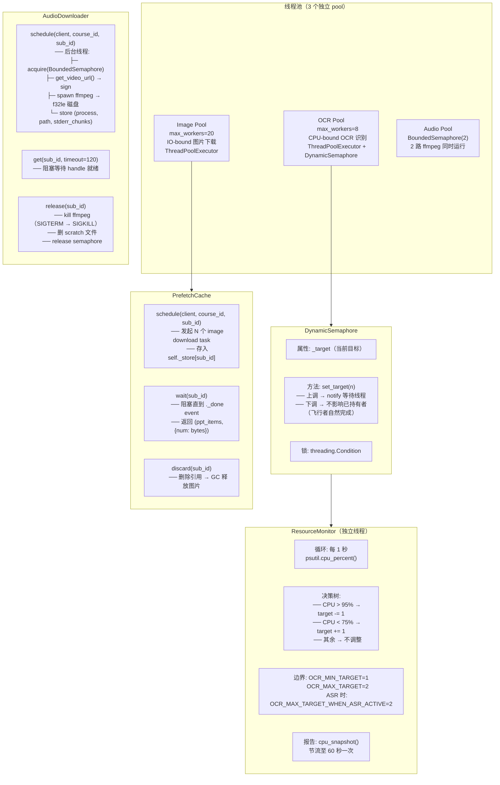

#### DynamicSemaphore 设计

Python 标准库的 `BoundedSemaphore` 不能动态调整 permit 数。`DynamicSemaphore` 用 `threading.Condition` 实现一个可调整的并行门控：

```python
class DynamicSemaphore:
    def __init__(self, initial=1):
        self._cond = threading.Condition()
        self._permits = initial
        self._acquired = 0

    def acquire(self):
        with self._cond:
            while self._acquired >= self._permits:
                self._cond.wait()
            self._acquired += 1

    def release(self):
        with self._cond:
            self._acquired -= 1
            self._cond.notify()

    def set_target(self, n):
        with self._cond:
            self._permits = n
            self._cond.notify_all()
```

**关键**：`set_target()` 下调时不会剥夺已持有的 permit。正在运行的 OCR worker 自然结束后不再补充新的，直到目标值以下。上涨时通过 `notify_all()` 唤醒等待者。

#### OCR 调度决策

每 1 秒 `psutil.cpu_percent(interval=None)` 采样当前 CPU 占用率：

```
cpu_percent > 95%  and target > OCR_MIN_TARGET → 减少 1
cpu_percent < 75%  and target < effective_max → 增加 1
其他：不变
```

用 CPU 低阈值（75%）避免频繁波动：在一个 target 仅 1-2 的体系中，每次调整都是约 50% 的并发变化，需要足够的 hysteresis。

#### ASR 主动通知

`LectureRunner` 在 ASR 前调用 `scheduler.set_asr_active(True)`，结束后 `set_asr_active(False)`：

```python
self._scheduler.set_asr_active(True)
try:
    transcript, segments = self._transcriber.transcribe_tail(...)
finally:
    self._scheduler.set_asr_active(False)
```

ASR 激活时，`effective_max_target` 降至 `OCR_MAX_TARGET_WHEN_ASR_ACTIVE`（默认=2），在 4 核 runner 上分配约 2 核给 OCR（ASR 多线程解码头占用其他 2 核）。

---

### LLM 摘要生成（`src/ai/bucketer.py` + `src/ai/summarizer.py`）

#### Prompt 组装（bucketer.py）

两种模式，由数据源决定：

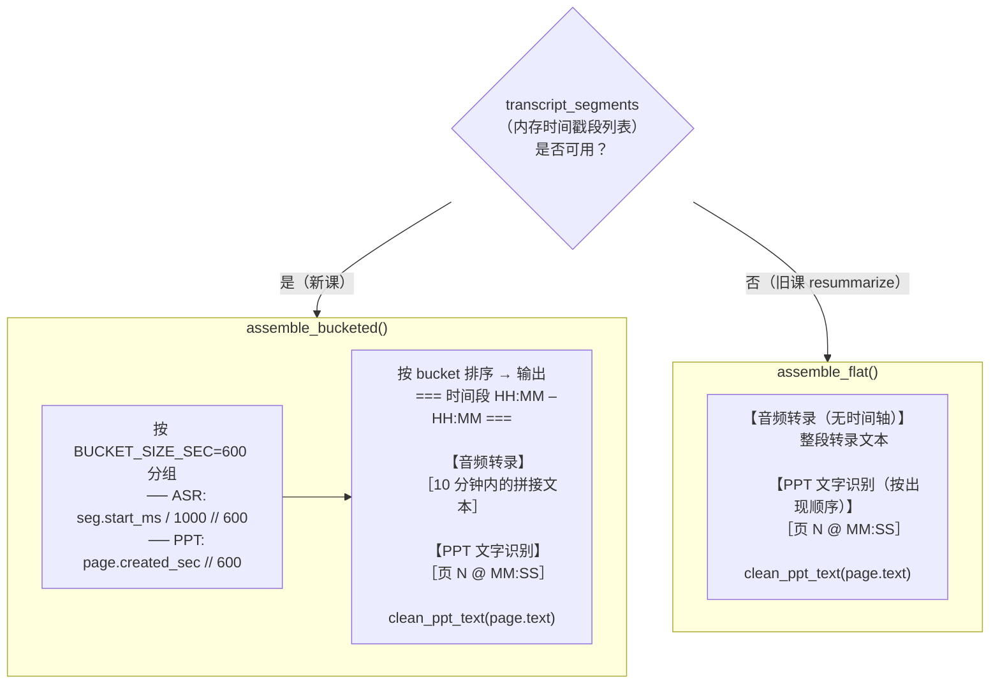

**设计决策**：transcript segments 从**不持久化**到数据库。它们由 Transcriber 在 ASR 期间产生，用于 prompt 组装，然后丢弃。DB 只存拼接后的 `transcript` 字符串。这避免了存储翻倍，但也意味着旧课的 prompt 只能使用 flat 模式（无时间戳 Bucket 对齐）。

#### LLM 调用（summarizer.py）

**多服务商自动回退**：

```python
MODEL_PROVIDERS = [
    {"name": "modelscope", "api_key_env": "DASHSCOPE_API_KEY", "models": [...]},
    {"name": "deepseek",   "api_key_env": "DEEPSEEK_API_KEY",  "models": [...]},
    {"name": "gemini",     "api_key_env": "GEMINI_API_KEY",    "models": [...]},
]

# resolve_model_providers() 处理逻辑：
# 1. 删除 API key 未设置的服务商
# 2. 同名的多个条目合并 models 到首次出现的条目
# 3. 按原列表顺序返回
```

**System Prompt 关键指令**（中文 Markdown 约 1000 字）：

- 标题级别限制：只允许 `###`/`####`/`#####`（禁止 `#`/`##`）
- 段落为主，合理使用枚举，禁止拆碎成 bullet point 短句
- LaTeX 公式用 `$...$`/`$$...$$`，公式中不可含中文
- 压缩比约 1:7，90 分钟课程约 5000 字
- 优先以 PPT 文字修正音频同音字错误
- 以讲师讲解逻辑组织主线，同时补充 PPT 知识
- temperature 去掉（使用 provider 默认值）

**超时**：每 180 秒。**Token 日志**：当 API 返回 `usage` 字段时打印 prompt/completion token 数。

---

### 数据库持久化方案

#### 存储架构

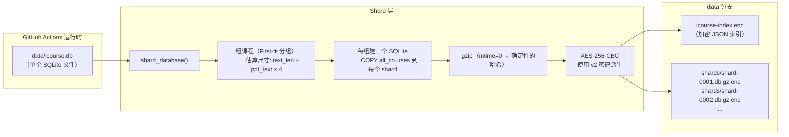

**为什么要分片**：GPT shard 大小约 10MB（压缩后约 2MB）。前端增量更新时只下载变更的 shard，而不是整个数据库（目前 ~20MB，首次同步前端跨 ~100MB 解压后可压缩到 2MB）。shard 边界在 course 级别，跨课程的操作就需要跨 shard 查询。

#### 密码派生

v2：（100,000 PBKDF2 迭代）：

```python
def derive_new_password(stuid, uispsw):
    return sha256(f"ICSv2:{stuid}:{uispsw}").hexdigest()
```

Legacy：（10,000 迭代，仅用于向后兼容）：

```python
derive_legacy_password(stuid, uispsw, dashscope_key, smtp_password):
    return f"{stuid}{uispsw}{dashscope_key}{smtp_password}"
```

#### AES-256-CBC exactly格式（crypto_box.py）

```python
┌──────────────────┬──────────┬────────────────────────────────┐
│ Salted__ (8 bytes)│ Salt (8)  AES-256-CBC PKCS7 密文       │
└──────────────────┴──────────┴────────────────────────────────┘

密钥派生：
PBKDF2-HMAC-SHA256(password, salt, dkLen=48)
  ── 前 32 bytes = AES Key
  ── 后 16 bytes = IV
```

**wrong-key 检测**：AES-CBC + PKCS7 在解密时错误密钥有约 1/256 的概率不报错（PKCS7 padding 恰好有效）。`decrypt_with_fallback()` 接受一个 `validate` 回调（`is_gzip`/`is_sqlite`/`is_json_obj` 检查 magic bytes）以拒绝误报。

**确定性加密**：`encrypt(data, password, deterministic=True)` 使用 `sha256(data)[:8]` 作为 salt，相同输入产生相同密文。这使 git blob SHA 成为内容地址——未更改的 shard 在 git 层面自动复用。

#### merge_db.py（并发安全）

当两次 workflow 并行运行时，使用以下策略：

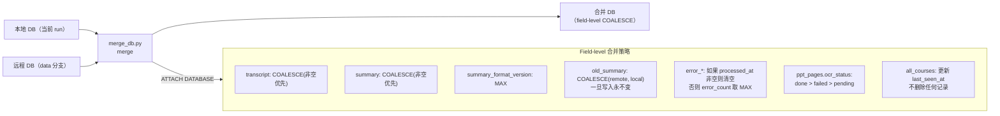

---

### 邮件渲染（`src/api/emailer.py`）

435 行，支持 Markdown + LaTeX 的批量邮件发送。

#### LaTeX CID 嵌入

```mermaid
flowchart LR
    subgraph 预处理["邮件内容生成"]
        M1["Markdown 原文含 LaTeX:
        $$E=mc^2$$ / $\\alpha$ / \\[...\\]"]
        M2["4 种模式 stash:
        $$ → \[ → $ → \(
        替换为 &lt;LATEX_N&gt;">
        M3["markdown 库转换为 HTML
        LaTeX 占位符保留"]
        M4["占位符替换回 img 标签"]
    end

    subgraph CID["Image 嵌入"]
        I1["fetch: https://latex.codecogs.com/png.latex?E=mc^2"]
        I2["8 线程并行预拉取所有公式"]
        I3["MIME multipart/related:
        ├── multipart/alternative:
        │   └── HTML 正文
        └── inline image:
            Content-ID: &lt;
            Content-Disposition: inline"]
    end

    M1 --> M2 --> M3 --> M4
    M4 --> I1
    I1 --> I2 --> I3
```

**关键参数**：
- 最小渲染高度 13px（``）
- 双维度：同时设置 HTML `width/height` 和 inline `style="width:Npx;height:Npx;max-width:none"`
- 回退：公式渲染失败时 `<code class="latex-fallback">` 用等宽字体显示原始 LaTeX

#### 邮件模板

支持「更新」标记：当某个 lectures 的 `is_update=True` 时（resummarize 产生的），邮件正文中新增一行 `<span class="update-badge">更新</span>` 并在主题行附加标记。

---

### OCR 模块（`src/ai/ocr.py`）

80 行，极简封装。

```python
_engine = None
_lock = threading.Lock()

def _get_engine():
    global _engine
    if _engine is None:
        with _lock:
            if _engine is None:          # 双重检查锁定
                from rapidocr_onnxruntime import RapidOCR
                _engine = RapidOCR()
    return _engine
```

**线程安全**：RapidOCR 实例本身是线程安全的。双重检查锁定模式确保正好加载一次。

**容错**：任何异常（解码失败、engine 错误）返回空列表 `[]`。

**预处理**：图片转换为 RGB 后再传递给 engine（PIL 可能以 RGBA 打开，RapidOCR 不支持 4 通道）。

---

### 前端浏览器端解密架构

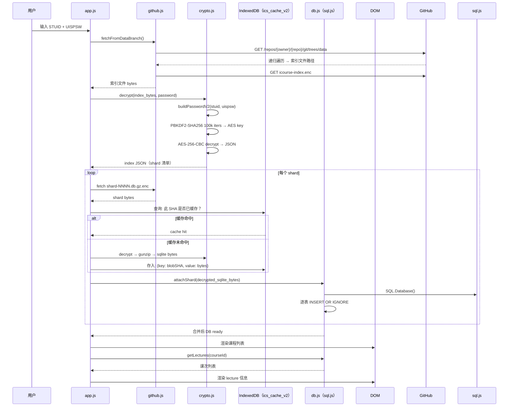

**IndexedDB 缓存架构**：shard 内容用 git blob SHA 键控。未更改的 shard 在 git 层面 blob SHA 不变，前端侧跳过网络下载 + 解密 + 解压。这是一个内容地址化缓存。

**订阅编辑器流程**：

1. **读** `courses` 表：`getSubscribedCourseIds()` → `SELECT course_id FROM courses`
2. **读** `all_courses` 表（学期完整目录）：搜索、筛选、排序
3. **注意**：GitHub `COURSE_IDS` secret 不可读回。前端使用 `courses` 表（实际运行过的课程）作为"当前订阅"的最佳信号
4. **写**：`setCourseIdsSecret()` → GitHub API PUT /repos/{owner}/{repo}/actions/secrets/COURSE_IDS（需要 PAT 的 Actions: Read and write 权限）
5. **缓存**：localStorage `lastSubscribed` 重载间额外缓存
6. **触发**：`triggerCheckWorkflow()` → `workflow_dispatch` check.yml → 启动执行

---

### CI/CD 管道

#### check.yml 步骤

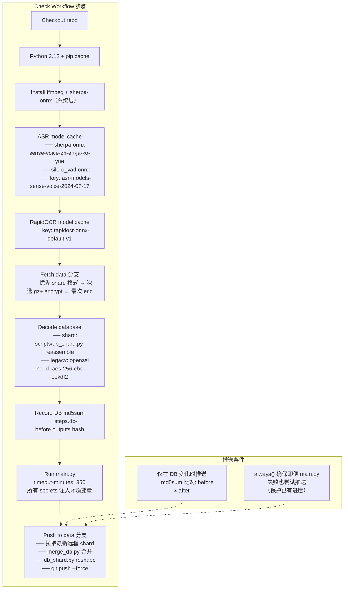

**解密回退**（workflow shell 脚本）：

```bash
# openssl 实现 v2/legacy 双回退
NEW_KEY=$(printf '%s' "ICSv2:${STUID}:${UISPSW}" | sha256sum | cut -d' ' -f1)
LEGACY_KEY="${STUID}${UISPSW}${DASHSCOPE_API_KEY}${SMTP_PASSWORD}"

// 先尝试 v2（100k 迭代），然后 legacy（10k 迭代）
if openssl enc -aes-256-cbc -d -pbkdf2 -iter 100000 ...; then
    echo "v2"
elif openssl enc -aes-256-cbc -d -pbkdf2 ... -pass pass:"$LEGACY_KEY"; then
    echo "legacy"
fi
```

---

### 数据模型

#### 表结构

```sql
CREATE TABLE courses (
    course_id TEXT PRIMARY KEY,
    title TEXT,
    teacher TEXT
);

CREATE TABLE lectures (
    sub_id TEXT PRIMARY KEY,            -- 课次编号
    course_id TEXT NOT NULL,
    sub_title TEXT, date TEXT,
    transcript TEXT,                    -- 语音识别结果（join 后的纯文本）
    summary TEXT,                       -- 当前最新摘要
    old_summary TEXT,                   -- 保存上一次的摘要（v0→v2 升级前版本）
    processed_at TEXT, emailed_at TEXT,
    error_msg TEXT,                     -- 最后一个错误消息
    error_count INTEGER DEFAULT 0,      -- 失败次数
    error_stage TEXT,                   -- 错误发生阶段（"transcribe" / "summarize"）
    summary_model TEXT,                 -- 生成摘要的模型标识
    summary_format_version INTEGER DEFAULT 0
);                                     -- 0=old, 1=v2 (PPT-aware)

CREATE TABLE ppt_pages (
    sub_id TEXT NOT NULL,
    page_num INTEGER NOT NULL,
    created_sec INTEGER NOT NULL,       -- iCourse 截图时间
    pptimgurl TEXT,                     -- 图片 URL（仅用作引用）
    text TEXT,                          -- OCR 识别文字
    ocr_status TEXT NOT NULL DEFAULT 'pending',  -- pending/done/dedup_dropped/invalid/failed
    ocr_at TEXT,                        -- OCR 完成时间
    dhash TEXT,                         -- dHash 感知哈希（去重用+调试）
    PRIMARY KEY (sub_id, page_num)
);

CREATE TABLE all_courses (
    course_id TEXT NOT NULL,
    term TEXT NOT NULL,                 -- 学期代码（如 "25"）
    title TEXT, teacher TEXT, dept TEXT,  -- 学院名（兼容多个字段名）
    last_seen_at TEXT,                  -- Catalog 爬取时间戳
    PRIMARY KEY (course_id, term)
);
```

#### 运行时迁移

```python
def _init_tables(self):
    existing = {col for col in PRAGMA table_info(lectures)}
    for col, typedef in LECTURES_MIGRATION_COLUMNS:
        if col not in existing:
            ALTER TABLE lectures ADD COLUMN col typedef
```

当前迁移列：
- `error_msg` → `error_count` → `error_stage` → `summary_model` → `summary_format_version` → `old_summary`

**shard 迁移**：`reassemble_database()` 在 `INSERT ... SELECT *` 之前调用 `_migrate_shard_schema()`，对每个 attached shard 检查是否缺列并 `ALTER TABLE shard.xxx ADD COLUMN` 补齐。

---

### 依赖清单

```
# 通信与协议
requests                          # HTTP 客户端，WebVPN session
pycryptodome                      # AES-128-CFB/RSA PKCS1_v1.5/AES-256-CBC

# 语音识别
sherpa-onnx                       # SenseVoice/FireRed/Zipformer ASR
numpy                             # PCM 音频采样处理

# LLM 服务
openai                            # OpenAI 兼容 API 调用

# 图像处理
pillow + imagehash                # PPT dHash 感知哈希
rapidocr-onnxruntime              # OCR 文字识别（ONNX runtime ~20MB）
opencv-python-headless            # RapidOCR 底层图像处理

# 邮件
markdown + pygments               # Markdown → HTML + 代码高亮

# 运行时
psutil                            # CPU 监控（ResourceMonitor）
```

可选依赖（仅 PDF 导出）：
```
weasyprint + cairosvg + flit-core # HTML → PDF 渲染
```

---

### 关键设计决策总结

| 决策 | 选择 | 替代方案 | 理由 |
|---|---|---|---|
| ASR 后端 | SenseVoice（插件式可替换） | 仅 FireRed | 多语言 ITN 支持，~25x 实时倍率效率高 |
| VAD 参数 | min_silence=0.8s, max_speech=30s | 默认 0.25s | 减少碎片，降低语种误判 |
| ASR postprocess | 基于正则+白名单 | 无处理 | 删除日语/韩语/English filler 对 LLM 无价值 token |
| PPT dedup | 滑动窗口 dHash（窗口=5, 阈值=2bit） | 普通直方图/全部 OCR | 感知哈希对 PPT 截图差异更鲁棒 |
| OCR 节流 | DynamicSemaphore + CPU 监控 | 固定线程池 | RapidOCR 单线程 CPU-bound，多线程不增产 |
| Prompt 模板 | 10 分钟 Bucket 对齐 | 整段 Feed | 保留时间上下文，减小每段损失 |
| LLM 配置 | 列表式多 provider 自动回退 | 仅一个 provider | 任意 provider 都可，任何 Key 失效可通过回退自动切换 |
| 数据库加密 | AES-256-CBC + PBKDF2 | 无加密 | 公开仓库存课程数据需加密保护 |
| 数据库分片 | 按课程组分割 ~10MB/shard | 单文件 | 前端增量更新，无需下载整个 DB |
| 手机端推送 | QQ SMTP 邮件 | Telegram/钉钉/微信 | QQ 邮箱最稳定，大多数中文用户使用 |
| 线程安全 | lock-per-method 模式 | 锁-free / Channel 队列 | OCR worker 共享 DB 实例，锁最简单 |
